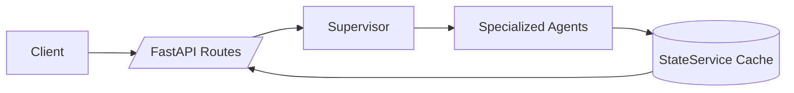

<div align="center">

# Digital War Room

**AI-native OSINT, built in public**

[](LICENSE)
[](https://www.python.org/)
[](https://nodejs.org/)

> **Digital War Room is an AI-native OSINT project that fuses fragmented conflict signals into one visual picture—escalation score, theater context, and BLUF-style briefings—with methodology and sources you can inspect.**

**Try it:** [Live Demo](https://digital-war-room.com) · [Docs](https://digital-war-room.com/docs/documentation) · [Local quickstart](#getting-started-live-demo--local-quickstart)

Canonical in code: [`PINNED_ONE_LINER`](src/lib/seoCopy.ts) — when you change the wording, sync `index.html` / `app/index.html` meta and JSON-LD. **Author and social bios** live on the [website](https://digital-war-room.com) (footer), not duplicated here.

Real-time conflict monitoring with specialized agents across GEOINT, SIGINT, SOCMINT, FININT, CYBER, and related domains — orchestrated by a single Claude Sonnet supervisor with rule-based routing.

*Built at the intersection of AI engineering, international relations, and OSINT tradecraft. This is a serious open pipeline—not a claim to be a finished enterprise intelligence product.*

[Live site](https://digital-war-room.com) · [Issues](https://github.com/lina767/digital-war-room/issues)

</div>

---

## OSINT Multi-Agent Intelligence Platform

Digital War Room deploys **11+ specialized OSINT agents** — supervised by a Claude Sonnet orchestrator — to monitor, analyze, and synthesize intelligence from open sources. Instead of aggregating headlines, it produces **structured assessments** (scores, BLUF-style briefings, and source-linked findings) across multiple streams: sanctions/finance, flight patterns, protests, cyber signals, and more.

**Why it matters:** Many dashboards show *what happened*. Digital War Room aims to help you interpret *what it may mean* — by cross-referencing streams and surfacing where signals corroborate (or contradict) each other.

---

## Real-Time Conflict Monitoring Dashboard (Demo)

Use the live dashboard to see the platform’s full loop: pick a conflict context → run analysis → watch streaming updates → read the BLUF briefing with source-backed findings.

### Screenshots / GIFs (add yours)

This repo currently ships without media assets. Here’s the recommended layout once you capture them (see the workflow below).

<!--
Add files under: docs/assets/


Optional GIF (10–20s):

-->

### What to click in the live demo

- Open the dashboard and pick a conflict context (e.g. `Iran`).
- Hit **Run Analysis** (or open the latest cached result) and watch the briefing + panels populate.
- Use **Documentation → Source Directory** to inspect sources and mappings.

### Who is this for?

- **OSINT builders** who want a real multi-agent pipeline they can inspect and extend
- **Researchers / analysts** who want cross-stream synthesis (not just a news feed)
- **Policy / newsroom / NGO workflows** that need a fast situational picture with traceable sources

### Why better than aggregators?

- **Multi-stream corroboration**: signals are compared across domains (finance, flights, protests, cyber, energy)
- **Structured outputs**: scores + key findings + briefings (not a pile of links)
- **Inspectable methodology & sources**: the “why” is part of the product (docs hub + source directory)

### Use cases

- **Daily situational picture** for a theater (score, threat level, BLUF briefing, key findings)
- **Source traceability** for briefs: jump from a claim to the originating stream and source directory
- **Cost-controlled monitoring**: rule-based agents by default; optional supervisor modes for savings

### Capture screenshots & a demo GIF (10–15 minutes)

1. Open the live demo at desktop width (e.g. 1440px).
2. Capture 3 screenshots:
   - Dashboard overview (score + map)
   - Agent monitor/panel
   - Briefing / intelligence feed
3. Optional: record a 10–20s clip (“Run Analysis” → stream → briefing updates) and convert to GIF.
4. Save under `docs/assets/`:
   - `docs/assets/dashboard-overview.png`
   - `docs/assets/agent-monitor.png`
   - `docs/assets/briefing-panel.png`
   - `docs/assets/demo-run-analysis.gif` (optional)
5. Uncomment the image block above to embed them in the README.

---

## Documentation (Start here)

- **How it works (UX & flows):** [docs/how-it-works.md](docs/how-it-works.md) (canonical in-product: [Documentation → How It Works](https://digital-war-room.com/docs/documentation?doc=how-it-works))
- **Architecture:** [docs/ARCHITECTURE.md](docs/ARCHITECTURE.md)
- **API overview:** [docs/API-REFERENCE.md](docs/API-REFERENCE.md)
- **Deployment & env:** [docs/DEPLOYMENT.md](docs/DEPLOYMENT.md)
- **API keys & backend config:** [docs/API-KEYS.md](docs/API-KEYS.md)

<details>
<summary><strong>Deep dives (methodology, governance, project index)</strong></summary>

| Topic | Repository |
|--------|----------------|
| **Attention playbook** (audience, content loop, credibility) | [docs/ATTENTION-PLAYBOOK.md](docs/ATTENTION-PLAYBOOK.md) |
| Conflict prioritization | [docs/CONFLICT-PRIORITIZATION.md](docs/CONFLICT-PRIORITIZATION.md) |
| Full project index | [docs/PROJECT-DOCUMENTATION.md](docs/PROJECT-DOCUMENTATION.md) |
| Privacy & GDPR governance | [docs/PRIVACY-GDPR-DSGVO.md](docs/PRIVACY-GDPR-DSGVO.md) |
| Retention policy | [docs/DATA-RETENTION-POLICY.md](docs/DATA-RETENTION-POLICY.md) |
| Audit trail policy | [docs/AUDIT-TRAIL-POLICY.md](docs/AUDIT-TRAIL-POLICY.md) |
| DSR runbook | [docs/DSR-RUNBOOK.md](docs/DSR-RUNBOOK.md) |
| Contributing | [CONTRIBUTING.md](CONTRIBUTING.md) |

</details>

---

## Architecture

```
┌─────────────────────────────────────────────────────────────────┐
│                    CLAUDE SONNET SUPERVISOR                       │
│         Orchestrates agents · Resolves conflicts · Briefs        │
└──────────────┬──────────────────────────────────┬───────────────┘
               │                                  │
    ┌──────────▼──────────┐            ┌──────────▼──────────┐
    │   INTELLIGENCE LAYER │            │   MONITORING LAYER   │
    │                      │            │                      │
    │  📡 SIGINT Agent     │            │  🌍 GEOINT Agent     │
    │  💰 FININT Agent     │            │  📱 SOCMINT Agent    │
    │  🔒 CYBER Agent      │            │  📰 NEWS Agent       │
    │  🏛️ DIPLO Agent      │            │  ⚡ ENERGY Agent     │
    │  🔬 TECHINT Agent    │            │  ✊ PROTEST Agent    │
    │                      │            │  📍 PROXIMITY Agent  │
    └──────────┬───────────┘            └──────────┬───────────┘
               │                                   │
    ┌──────────▼───────────────────────────────────▼──────────┐
    │                      DATA SOURCES                        │
    │  ACLED · GDELT · OONI · IODA · Polymarket · ADS-B       │
    │  GreyNoise · OpenSanctions · OFAC · EU Sanctions List    │
    └─────────────────────────────────────────────────────────┘
```

---

## Agent overview

| Agent | Role | Key data sources | Often pairs with |
|-------|------|------------------|------------------|
| **SIGINT** | Flight patterns, airspace, ADS-B | ADS-B Exchange, Flightradar24 | GEOINT, PROXIMITY |
| **FININT** | Sanctions, ownership chains, commodities | OpenSanctions, OFAC SDN, EU list | ENERGY, DIPLO |
| **GEOINT** | Geographic conflict events, mapping | ACLED, GDELT | SIGINT, NEWS |
| **SOCMINT** | Social narratives, sentiment | X/Twitter, Telegram | PROTEST, NEWS |
| **NEWS** | Breaking news, multilingual | RSS, wires | All agents |
| **CYBER** | Outages, DDoS, hacktivism | GreyNoise, OONI, IODA | SIGINT, TECHINT |
| **ENERGY** | Infrastructure, Hormuz / commodity stress | Maritime AIS, oil APIs | FININT, GEOINT |
| **TECHINT** | Tech / defense industry signals | SIPRI, defense wires | SIGINT, DIPLO |
| **PROTEST** | Unrest, crackdowns | ACLED, SOCMINT | SOCMINT, CYBER |
| **DIPLO** | Diplomatic / legal signals | UN, ICJ, sanctions lists | FININT, ENERGY |
| **PROXIMITY** | Geographic risk / proximity | FIRMS, OSM | GEOINT, SIGINT |

---

## Key features

- **Interactive theater map** — Conflict visualization with overlays (events, flights, maritime, protests).
- **Daily intelligence briefings** — Synthesized assessments with confidence and attribution.
- **Predictive outlook** — Scenario-style views using market-implied signals (e.g. Polymarket) where configured.
- **Source directory** — Trace claims back to primary sources with reliability context.
- **Strait of Hormuz monitor** — Maritime and commodity stress through the chokepoint.
- **Sanctions-oriented workflows** — OFAC / EU / UN screening patterns where APIs and keys are configured.
- **Documentation hub routing** — `/how-it-works`, `/methodology`, and `/sources` redirect to `/docs/documentation` with `doc` query params.
- **Full-width content pages** — Documentation/legal/blog/newsletter pages use the available desktop width by default.

---

## FastAPI + React OSINT Stack

| Layer | Technology |
|-------|------------|
| **Frontend** | React 18, TypeScript, Vite, Tailwind CSS, shadcn-style UI |
| **Backend** | Python 3.11+, FastAPI, Pydantic |
| **AI** | Claude Sonnet (supervisor), rule-based agent dispatch |
| **Hosting** | Vercel (frontend), Railway (backend) |
| **Analytics** | Vercel Analytics |

---

## Why rule-based routing + Claude supervisor (not LangGraph)?

The project moved from a full LangGraph multi-agent graph to a **hybrid**: rule-based dispatch with one Claude Sonnet supervisor for synthesis. That reduced token cost substantially while keeping analytical quality for contradiction resolution, source weighting, and natural-language briefings.

---

## Getting Started (Live Demo + Local Quickstart)

### Live demo

- **Live site:** `https://digital-war-room.com`
- **Docs hub:** `https://digital-war-room.com/docs/documentation`
- If you want the full picture: run an analysis once, then inspect sources via **Source Directory**.

### Prerequisites (local)

- Node.js 18+
- Python 3.11+

### Local quickstart (frontend)

```bash
git clone https://github.com/lina767/digital-war-room.git
cd digital-war-room
npm install
npm run dev
# → http://localhost:8080
```

### Local quickstart (backend)

```bash
cd backend
pip install -r requirements.txt
# optional: lint, tests, types
pip install -r requirements-dev.txt
uvicorn main:app --reload
# → http://localhost:8000
```

Without external API keys, you can still use the health checks and interactive docs (`/health`, `/docs`). For live analysis, configure keys as needed in [docs/API-KEYS.md](docs/API-KEYS.md).

### Environment variables

In the **project root**, create `.env` as needed:

```env
VITE_API_URL=http://localhost:8000
```

Copy and fill examples from:

- Root: `.env.development.example`, `.env.staging.example`, `.env.production.example`
- Backend: `backend/.env.example` and `backend/.env.*.example`

Secrets are documented in [docs/API-KEYS.md](docs/API-KEYS.md).

### Docker Compose (full stack)

```bash
docker compose up --build
```

- Frontend: `http://localhost:8080`
- Backend: `http://localhost:8000`
- Postgres (pgvector): `localhost:5432`

For local Docker development details, see [docs/DOCKER-DEV.md](docs/DOCKER-DEV.md). For production deployment, see [docs/DEPLOYMENT.md](docs/DEPLOYMENT.md).

---

## API quick reference

Base URL (local): `http://localhost:8000`

| Endpoint | Method | Purpose |
|----------|--------|---------|
| `/health` | GET | Liveness |
| `/api/analyze/status?conflict=Iran` | GET | Cache / error status |
| `/api/analyze/latest?conflict=Iran` | GET | Latest cached analysis |
| `/api/analyze/refresh?conflict=Iran` | POST | Trigger background refresh |
| `/api/analyze/stream?conflict=Iran` | GET (SSE) | Stream agent + supervisor events |
| `/api/agents/status` | GET | Last per-agent snapshot |
| `/api/agents/history` | GET | Recent run history |

Interactive docs: `http://localhost:8000/docs` (local). See [docs/API-REFERENCE.md](docs/API-REFERENCE.md) for more.

### Backend request flow



---

## Code quality & tests

Backend tests live under `backend/tests/` (`test_agents/`, `test_integration/`, `test_api/`, `conftest.py`).

```bash
cd backend
pytest
mypy .
ruff check .
```

Coverage uses `pytest-cov` with a minimum threshold (see `pytest` config in the backend).

[`.pre-commit-config.yaml`](.pre-commit-config.yaml) can run Ruff, mypy, and Prettier — install with `pre-commit install` if you use it locally.

---

## Scripts (frontend)

| Command | Description |
|---------|-------------|
| `npm run dev` | Dev server (Vite) |
| `npm run build` | Production build |
| `npm run preview` | Preview production build |
| `npm run lint` | ESLint |
| `npm run test` | Vitest |
| `npm run typecheck` | TypeScript check |
| `npm run version:patch` / `minor` / `major` | SemVer bump |

---

## DevOps & maintenance

- **Dependabot:** [`.github/dependabot.yml`](.github/dependabot.yml) — automated updates for GitHub Actions, npm, and pip.
- **Versioning:** [CHANGELOG.md](CHANGELOG.md) follows the project’s release notes.

---

## Roadmap

- [ ] Multi-theater support (beyond Middle East)
- [ ] Collaborative annotation layer
- [ ] API access for researchers
- [ ] Webhook-based alerts
- [ ] Mobile-optimized briefing view
- [ ] Integration with Bellingcat-style verification tooling

---

## Contributing

Contributions are welcome — new data pipelines, agent improvements, or UI fixes.

1. Fork the repository  
2. Branch (`git checkout -b feature/your-feature`)  
3. Commit with clear messages  
4. Push and open a Pull Request  

See [CONTRIBUTING.md](CONTRIBUTING.md) for local setup and how to report issues.

---

## License

[MIT License](LICENSE) — Copyright (c) 2026 Lina Braun.

---

<div align="center">

**Lina Braun** — Political science & AI engineering

[Live site](https://digital-war-room.com) · [Report a bug](https://github.com/lina767/digital-war-room/issues) · [Feature request](https://github.com/lina767/digital-war-room/issues)

</div>
