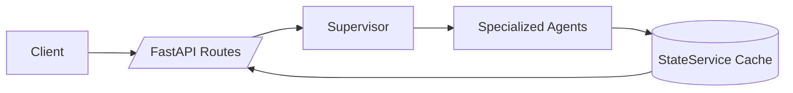

<div align="center">

# 🛰️ Digital War Room

**AI-Powered Multi-Agent OSINT Intelligence Platform**

The only open-source geopolitical intelligence platform combining 11 specialized AI agents with political science methodology — monitoring global conflicts across GEOINT, SIGINT, SOCMINT, FININT, CYBER & TECHINT in real time.

*Built at the intersection of AI engineering, international relations, and OSINT tradecraft.*

</div>

---

## 🔍 What is Digital War Room?

Digital War Room is a real-time geopolitical intelligence platform that deploys **11 specialized OSINT agents** — supervised by a single Claude Sonnet orchestrator — to monitor, analyze, and synthesize intelligence from dozens of open sources. Unlike simple dashboards that aggregate news feeds, DWR applies structured analytical frameworks to transform raw signals into actionable intelligence assessments.

**Why this matters:** Most OSINT dashboards show you what happened. Digital War Room tells you **what it means** — by cross-referencing financial sanctions data with flight patterns, protest activity with internet shutdowns, and diplomatic signals with commodity flows.

---

## 🏗️ Architecture

```
┌─────────────────────────────────────────────────────────────────┐
│                    CLAUDE SONNET SUPERVISOR                       │
│         Orchestrates agents · Resolves conflicts · Briefs        │
└──────────────┬──────────────────────────────────┬───────────────┘
               │                                  │
    ┌──────────▼──────────┐            ┌──────────▼──────────┐
    │   INTELLIGENCE LAYER │            │   MONITORING LAYER   │
    │                      │            │                      │
    │  📡 SIGINT Agent     │            │  🌍 GEOINT Agent     │
    │  💰 FININT Agent     │            │  📱 SOCMINT Agent    │
    │  🔒 CYBER Agent      │            │  📰 NEWS Agent       │
    │  🏛️ DIPLO Agent      │            │  ⚡ ENERGY Agent     │
    │  🔬 TECHINT Agent    │            │  ✊ PROTEST Agent    │
    │                      │            │  📍 PROXIMITY Agent  │
    └──────────┬───────────┘            └──────────┬───────────┘
               │                                   │
    ┌──────────▼───────────────────────────────────▼──────────┐
    │                      DATA SOURCES                        │
    │  ACLED · GDELT · OONI · IODA · Polymarket · ADS-B       │
    │  GreyNoise · OpenSanctions · OFAC · EU Sanctions List    │
    └─────────────────────────────────────────────────────────┘
```

---

## Agent Breakdown

| Agent | What it does | Key data sources | Communicates with |
|-------|--------------|------------------|-------------------|
| **SIGINT** | Monitors flight patterns, airspace closures, and ADS-B anomalies | ADS-B Exchange, Flightradar24 | GEOINT, PROXIMITY |
| **FININT** | Tracks sanctions compliance (OFAC/EU/UN), ownership chains (50% rule), commodity price signals | OpenSanctions, OFAC SDN, EU Consolidated List | ENERGY, DIPLO |
| **GEOINT** | Analyzes geographic conflict data, mapping strike events and territorial changes | ACLED, GDELT | SIGINT, NEWS |
| **SOCMINT** | Processes social media intelligence, narrative tracking, and sentiment analysis | X/Twitter feeds, Telegram channels | PROTEST, NEWS |
| **NEWS** | Aggregates and classifies breaking news across multilingual sources | RSS feeds, wire services (Reuters, AP) | All agents |
| **CYBER** | Detects internet disruptions, DDoS campaigns, and hacktivist activity | GreyNoise, OONI, IODA, Cloudflare Radar | SIGINT, TECHINT |
| **ENERGY** | Monitors energy infrastructure, commodity flows, and Strait of Hormuz shipping | Maritime AIS, Oil price APIs | FININT, GEOINT |
| **TECHINT** | Tracks military technology deployments, weapons systems, and defense industry signals | SIPRI, defense wire services | SIGINT, DIPLO |
| **PROTEST** | Maps civil unrest, protest movements, and government crackdowns | ACLED, SOCMINT feeds | SOCMINT, CYBER |
| **DIPLO** | Analyzes diplomatic statements, UN votes, and treaty activity | Government press offices, UN records | FININT, ENERGY |
| **PROXIMITY** | Calculates geographic risk scores and proximity-based threat assessments | Aggregated geolocation data | GEOINT, SIGINT |

---

## ✨ Key Features

- **🗺️ Interactive Theater Map** — Real-time conflict visualization with multi-layer overlays — strike events, flight paths, naval movements, and protest hotspots on a single interactive map.
- **📋 Daily Intelligence Briefings** — AI-generated morning briefings synthesizing overnight developments across all 11 agents into a structured assessment with confidence levels and source attribution.
- **🔮 Predictive Outlook** — Probabilistic forecasting integrating Polymarket prediction data with structured agent assessments for scenario analysis.
- **📂 Source Directory** — Transparent source attribution for every data point — every claim links back to its original source with reliability grading.
- **⚓ Strait of Hormuz Monitor** — Dedicated module tracking maritime traffic, commodity flows, and insurance risk through the world's most critical oil chokepoint.
- **🛡️ Sanctions Compliance Engine** — Automated OFAC/EU/UN sanctions screening with 50% ownership-chain analysis — the same methodology used by compliance departments at major financial institutions.

---

## 🛠️ Tech Stack

| Layer | Technology |
|-------|------------|
| **Frontend** | React 18, TypeScript, Vite, Tailwind CSS, shadcn/ui |
| **Backend** | Python 3.12, FastAPI, Pydantic |
| **AI Orchestration** | Claude Sonnet (single supervisor), rule-based agent routing |
| **Hosting** | Vercel (frontend), Railway (backend) |
| **Analytics** | Vercel Analytics |

---

## Why Rule-Based + Claude Supervisor (not LangGraph?)

DWR originally ran on a full LangGraph multi-agent graph. We migrated to a **hybrid architecture** — rule-based agent dispatch with a single Claude Sonnet supervisor for synthesis — reducing token costs by **~70%** while maintaining analytical quality. The supervisor handles what rules can't: resolving contradictory signals, weighting source reliability, and generating natural-language briefings.

---

## 🚀 Getting Started

### Prerequisites

- Node.js 18+
- Python 3.12+

### Frontend

```bash
git clone https://github.com/lina767/digital-war-room.git
cd digital-war-room
npm install
npm run dev
# → http://localhost:8080
```

### Backend

```bash
cd backend
pip install -r requirements.txt
# optional, for lint/tests/type checks
pip install -r requirements-dev.txt
uvicorn main:app --reload
```

### Environment Variables

Create a `.env` file in the project root:

```env
VITE_API_URL=your_backend_url
```

---

## 🔌 API Quick Reference

Backend base URL: `http://localhost:8000`

| Endpoint | Method | Purpose |
|---------|--------|---------|
| `/health` | GET | Liveness probe |
| `/api/analyze/status?conflict=Iran` | GET | Cache/error status for a conflict |
| `/api/analyze/latest?conflict=Iran` | GET | Latest cached analysis |
| `/api/analyze/refresh?conflict=Iran` | GET | Trigger background refresh |
| `/api/analyze/stream?conflict=Iran` | GET (SSE) | Stream per-agent + supervisor events |
| `/api/agents/status` | GET | Last per-agent status snapshot |
| `/api/agents/history` | GET | Recent run history |

OpenAPI docs are available at `http://localhost:8000/docs` in local development.

### Backend request flow



---

## ✅ Code Quality & Testing

Backend test layout:

```text
backend/tests/
├── test_agents/        # Unit tests for agent contracts and behavior
├── test_integration/   # Cross-module and orchestration contract tests
├── test_api/           # FastAPI endpoint tests
└── conftest.py         # Shared fixtures and mock payloads
```

Run backend quality checks:

```bash
cd backend
pytest
mypy .
ruff check .
```

Coverage is enforced with `pytest-cov` and a minimum threshold of **60%**.

Pre-commit hooks (`.pre-commit-config.yaml`) run:
- `ruff` (backend)
- `mypy` (backend)
- `prettier --check` (frontend/repo)

---

## 🗺️ Roadmap

- [ ] Multi-theater support (beyond Middle East)
- [ ] Collaborative annotation layer
- [ ] API access for researchers
- [ ] Webhook-based alert system
- [ ] Mobile-optimized briefing view
- [ ] Integration with Bellingcat verification tools

---

## 📜 Scripts

| Command | Description |
|---------|-------------|
| `npm run dev` | Start frontend dev server |
| `npm run build` | Production build |
| `npm run preview` | Preview production build |
| `npm run lint` | Run ESLint |
| `npm run test` | Run tests (Vitest) |

---

## 🤝 Contributing

Digital War Room is open source. Contributions are welcome — whether it's adding a new agent, improving an existing data pipeline, or fixing a UI bug.

1. Fork the repository
2. Create a feature branch (`git checkout -b feature/new-agent`)
3. Commit your changes (`git commit -m 'Add maritime intelligence agent'`)
4. Push to the branch (`git push origin feature/new-agent`)
5. Open a Pull Request

---

## 📄 License

This project is open source. See [LICENSE](LICENSE) for details.

---

<div align="center">

**Built by Lina — Political Science & AI Engineering**

*Combining academic rigor with engineering execution at the intersection of geopolitics and artificial intelligence.*

[Live Demo](https://digital-war-room.com) · [Report Bug](https://github.com/lina767/digital-war-room/issues) · [Request Feature](https://github.com/lina767/digital-war-room/issues)

</div>
