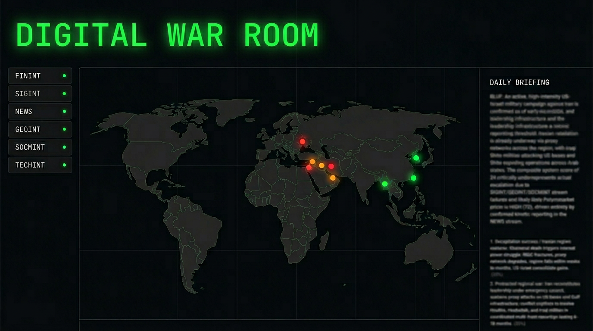

# Digital War Room

[](LICENSE) [](https://digital-war-room.com)

AI-powered OSINT intelligence platform — multi-agent system monitoring global conflicts across GEOINT, SIGINT, SOCMINT, FININT & TECHINT. **Live Demo:** [digital-war-room.com](https://digital-war-room.com)



## Features

- **11 intelligence agents** run in parallel (FININT, SIGINT, NEWS, GEOINT, SOCMINT, TECHINT, CYBER, ENERGY, PROTEST, DIPLO, PROXIMITY) with a single LLM supervisor synthesizing outputs
- **Near–real-time escalation scores** and BLUF-style key findings, scenarios, and compliance checks
- **Built-in compliance layer**: geofencing, AIS anomaly detection, supply-chain screening, OFAC/EU cross-referencing
- **Graceful degradation**: missing API keys yield empty results (no crashes); LLM failures fall back to rule-based scoring; per-agent timeouts keep the pipeline responsive

## Who it's for

- OSINT analysts and researchers
- Geopolitical risk consultants
- Intelligence professionals exploring AI-augmented workflows
- AI/ML engineers interested in multi-agent architectures

## Architecture

The backend runs 11 agents via `ThreadPoolExecutor`, each returning a structured payload; a supervisor LLM (Claude or GPT-4o) fuses them into one assessment. Frontend is a React dashboard with threat level, key findings, agent cards, and map overlays.

For a detailed diagram and agent/source table, see **[Architecture & agents](docs/social-assets/one-pager.md)**.

## Getting Started

```sh
# Install dependencies
npm install

# Start the development server
npm run dev
```

The frontend runs on `http://localhost:8080` by default. The backend is in `backend/` (Python, FastAPI); see [docs/DEPLOYMENT.md](docs/DEPLOYMENT.md) for running it locally or deploying.

### Environment Variables

Set the following in a `.env` file in the project root:

| Variable | Description |
|----------|-------------|
| `VITE_API_URL` | Backend API URL (e.g. Railway); **required** for deploy |

## Scripts

| Command | Description |
|---------|-------------|
| `npm run dev` | Start dev server |
| `npm run build` | Production build |
| `npm run preview` | Preview production build |
| `npm run lint` | Run ESLint |
| `npm run test` | Run tests |

## Documentation

- **[Deployment](docs/DEPLOYMENT.md)** — Frontend (Vercel), backend (Railway), env vars, custom domain
- **[API keys & env](docs/API-KEYS.md)** — All backend env vars and optional API keys per agent
- **[Architecture & one-pager](docs/social-assets/one-pager.md)** — Agent table, design decisions, tech stack

## Deployment

1. Set environment variables in your hosting platform (Vercel, Cloudflare Pages, etc.)
2. Build command: `npm run build` (runs `prebuild` → generates `public/sitemap.xml` with `lastmod`)
3. Output directory: `dist`

**SEO (pre-rendered routes):** The build produces one HTML file per route (e.g. `dist/how-it-works/index.html`). Configure your server so that requests to `/how-it-works` are served from `how-it-works/index.html` (or equivalent rewrite). Fallback for unknown paths should be `index.html` for the SPA.

**OG image:** `public/og-image.png` is used for social/snippet previews. Recommended size 1200×630 px. In your hosting config, set cache headers for `/og-image.png` if needed (e.g. `Cache-Control: public, max-age=86400`).

## Tech Stack

- **Frontend:** React, TypeScript, Vite, Tailwind CSS, shadcn/ui
- **Backend:** Python 3, FastAPI, LangChain/LangGraph
- **Payments:** Stripe
- **Analytics:** Vercel Analytics

## Contributing

See [CONTRIBUTING.md](CONTRIBUTING.md) for how to run locally, where to find docs, and how to report bugs or suggest features.

## License

[MIT](LICENSE)
