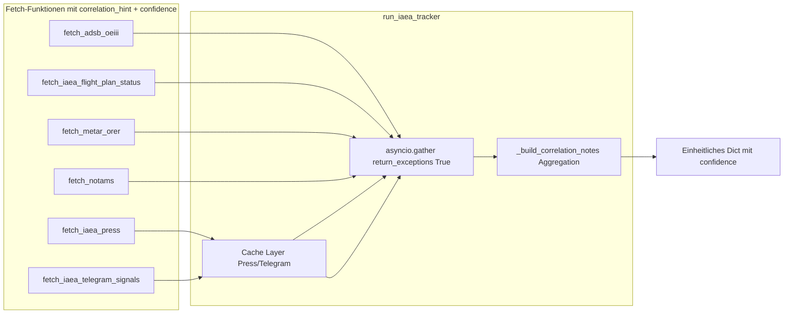

# IAEA-Tracker: Multisensor-Fusions-Strategie (2026) – Plan v2

Aktualisierter Plan inkl. METAR-Endpunkt, dezentraler Korrelationshinweise, Caching, Error-Isolation und Signal-Priorisierung.

---

## 1. Eurocontrol & Flugplan-Analyse (IFPS/NMOC)

- **Konfigurierbarer Flugplan-Status:** Optionales Env `IAEA_FLIGHTPLAN_STATUS_URL`; GET liefert z. B. `{"status": "no_new_request"|"cancelled"|"unknown", "last_updated_iso": "..."}`.
- Jede Fetch-Funktion liefert ein **eigenes `correlation_hint: str`** (und optional `confidence: "high"|"medium"|"low"`). Die Flugplan-Funktion erzeugt z. B.: `"Flugplan: keine neue Anfrage; Maschine parked (kein neuer Slot)."` mit `confidence: "medium"` (externe Quelle).
- Wenn URL nicht gesetzt: `flight_plan_status: "unknown"`, `correlation_hint: "Flugplan-Status: nicht konfiguriert."`, `confidence: "low"`.

---

## 2. ADS-B & Transponder (SIGINT-lite)

- **Hex:** `OEIII_ICAO_HEX` (Default 440333), direkte Hex-Abfrage ergänzen.
- **Boden-Modus:** `on_ground`/`gnd` in `_normalize_aircraft()` und Ausgabe; bei Boden + Position nahe ORER → `location_interpretation: "parked_erbil"`.
- **correlation_hint:** Von der ADS-B-Funktion selbst erzeugen, z. B. `"OE-III am Boden in Erbil (Hex 440333 bestätigt)."` → `confidence: "high"` (harter Datenpunkt).

---

## 3. METAR/TAF (GEOINT)

- **Quelle:** **Neuer NOAA-Endpunkt** `https://aviationweather.gov/api/data/metar?ids=ORER` (nicht der Legacy-Pfad `cgi-bin/data/metar.php`), damit es bei Deprecation nicht bricht.
- Parsing: visibility, RVR; `operational_delay_risk: true` bei RVR &lt; 500 m oder Sicht &lt; 800 m.
- **correlation_hint:** Von `fetch_metar_orer()` erzeugen, z. B. `"METAR ORER: RVR &lt; 500 m → operative Verzögerung möglich."` mit `confidence: "high"` (technischer Fakt).

---

## 4. Diplomatische Quellen / Rundeep (HUMINT/OSINT)

- Optionale Felder `comms_blackout_inference`, `ground_ops_signals` / `rundeep_crosscheck` im Schema; Platzhalter, wenn nicht konfiguriert.
- Wenn später eine Quelle angebunden wird: eigenes `correlation_hint` und `confidence` von dort liefern.

---

## 5. SOCMINT (Telegram Erbil/Kurdistan)

- **Technische Schuld dokumentieren:** Im Code klar kommentieren, dass **t.me/s/-Scraping fragil und rate-limited** ist; für ernsthaftes Monitoring wäre ein **Telethon-/Pyrogram-Client mit eigenem Account** stabiler. Für den MVP reicht der Web-Scrape.
- Env `IAEA_TELEGRAM_CHANNELS`; wenn gesetzt: Telegram-Posts abrufen (Shared Helper aus SOCMINT oder minimaler Scraper), Keyword-Filter (Erbil, Konvoi, Bashmakh, Haji Omeran, IAEA, Grossi).
- **correlation_hint:** Von der Telegram-Funktion, z. B. `"N Telegram-Hinweise auf Konvoi/Checkpoint (Erbil/Kurdistan)."` mit `confidence: "medium"` (weicher Hinweis).

---

## 6. Dezentrale Korrelation: correlation_hint pro Fetch

- **Jede Fetch-Funktion** gibt ein einheitliches Strukturelement zurück, z. B.:
  - `correlation_hint: str` – von der Funktion selbst erzeugter Kurztext.
  - `confidence: "high" | "medium" | "low"` – für Priorisierung (s. u.).
- **`_build_correlation_notes()`** **aggregiert nur**: Sie sammelt die `correlation_hint`-Strings (und optional die Confidences) aus allen Teilergebnissen und baut daraus die finale `correlation_notes`-Liste und die Summary. Keine komplexe Logik mehr in dieser einen Funktion – bleibt schlank und testbar.

---

## 7. Caching / Deduplication über Zeit

- **Anforderung:** Bei Aufruf von `run_iaea_tracker()` alle 5 Minuten sollen dieselben Telegram-Posts und IAEA-Pressemitteilungen nicht jedes Mal als „neu“ gelten.
- **Vorgehen:** Einfacher **In-Memory-Cache** mit TTL (z. B. 10–15 Minuten) oder ein **Set von gesehenen Post-IDs** (URL + published/id) mit TTL. Nach Ablauf werden Einträge verworfen.
- Konkret: Pro Quelle (IAEA-Press, Telegram) eine Cache-Schicht (z. B. `_seen_press_ids`, `_seen_telegram_ids` mit Timestamp); neue Items nur dann in „neu“/Korrelation aufnehmen, wenn ID noch nicht gesehen oder Cache abgelaufen. TTL über Env konfigurierbar (z. B. `IAEA_CACHE_TTL_MINUTES=15`).

---

## 8. Error-Isolation

- **Anforderung:** Wenn z. B. METAR-Fetch fehlschlägt, darf der **gesamte Tracker nicht crashen**.
- **Vorgehen:** Explizit **`asyncio.gather(..., return_exceptions=True)`** für alle parallelen Fetches. Pro Task: Bei Exception das Ergebnis durch ein Fallback-Dict ersetzen (z. B. `{"correlation_hint": "METAR: Abfrage fehlgeschlagen.", "confidence": "low", "error": str(e)}`), sodass `_build_correlation_notes()` weiterhin alle Säulen aggregieren kann. Kein Re-Raise – nur loggen und mit „unknown“/Fehler-Hinweis weiterarbeiten.

---

## 9. Priorisierung der Signale (confidence)

- **Anforderung:** Nicht alle Korrelationshinweise sind gleich wichtig – „OE-III am Boden in Erbil mit Hex bestätigt“ ist ein **harter** Datenpunkt, „2 Telegram-Posts erwähnen Konvoi“ ist **weich**. Supervisor und Frontend sollen gewichten können.
- **Vorgehen:** Pro Signal/Fetch-Ergebnis ein Feld **`confidence: "high" | "medium" | "low"`**:
  - **high:** Direkte technische Daten (ADS-B Hex + Boden + Position, METAR RVR/Sicht).
  - **medium:** Externe aber strukturierte Quellen (Flugplan-Status-URL, ggf. Rundeep), oder aggregierte Telegram-Meldungen.
  - **low:** Nicht konfiguriert, Fehler, oder rein interpretativ ohne harte Quelle.
- Im Rückgabe-Dict und in `correlation_notes` die Hints entweder mit Confidence-Label versehen oder als Liste von `{ "hint": "...", "confidence": "high"|"medium"|"low" }` übergeben, damit das Frontend/Supervisor priorisieren kann.

---

## 10. Konfiguration (.env.example)

- `OEIII_ICAO_HEX` (z. B. 440333)
- `IAEA_FLIGHTPLAN_STATUS_URL` (optional)
- `IAEA_TELEGRAM_CHANNELS` (kommagetrennt)
- `IAEA_CACHE_TTL_MINUTES` (z. B. 15)
- METAR: neuer Endpunkt fest im Code (`aviationweather.gov/api/data/metar?ids=ORER`), kein Key nötig.
- Optional für später: `IAEA_RUNDEEP_*` / Rundeep-URL dokumentieren.

---

## 11. Kurzfassung der zu ändernden Dateien

| Bereich | Datei | Änderung |
|--------|--------|----------|
| Tracker | `backend/agents/iaea_tracker.py` | METAR **neuer Endpunkt**; pro Fetch `correlation_hint` + `confidence`; `_build_correlation_notes()` nur Aggregation; In-Memory-Cache für Press/Telegram mit TTL; `asyncio.gather(..., return_exceptions=True)` + per-Task Fallback; Hex, Ground, ORER, Flugplan-URL, Telegram (mit Kommentar technische Schuld t.me/s). |
| SOCMINT | `backend/agents/socmint_agent.py` | Optional: Helper für IAEA-Telegram-Kanäle (wiederverwendbar). |
| Konfiguration | `backend/.env.example` | `OEIII_ICAO_HEX`, `IAEA_FLIGHTPLAN_STATUS_URL`, `IAEA_TELEGRAM_CHANNELS`, `IAEA_CACHE_TTL_MINUTES`, ggf. Rundeep. |
| Docs | `docs/` (API-KEYS/DEPLOYMENT) | METAR (neuer API-Pfad), Caching, Error-Isolation, confidence, Telegram-Schuld (Telethon/Pyrogram) erwähnen. |

---

## 12. Architektur-Überblick

Damit sind METAR zukunftssicher, Korrelation dezentral und testbar, Caching/Deduplication, Error-Isolation und Signal-Priorisierung im Plan verankert.
