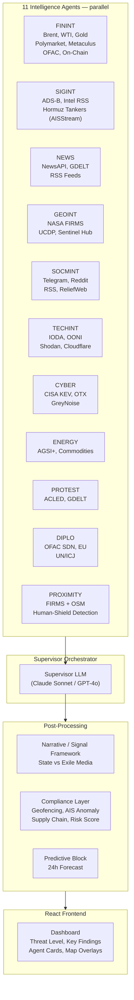

# Digital War Room – One-Pager

## What It Is

An AI-powered multi-agent OSINT platform that monitors geopolitical conflicts in near-real-time. The system orchestrates 11 specialized intelligence agents in parallel, fuses their outputs with an LLM supervisor, and delivers a unified threat assessment with escalation scores, key findings, scenarios, and compliance checks.

**Current focus:** Iran / Middle East.

## Who It's For

- OSINT analysts and researchers
- Geopolitical risk consultants
- Intelligence professionals exploring AI-augmented workflows
- AI/ML engineers interested in multi-agent architectures

## Architecture at a Glance

```
                        ┌──────────────────────────────────────────┐
                        │             Supervisor (LLM)             │
                        │   Claude Sonnet / GPT-4o – synthesizes   │
                        │   all 11 streams into one assessment     │
                        └────────────────┬─────────────────────────┘
                                         │ JSON payload
         ┌───────────────────────────────┼───────────────────────────────┐
         │               ThreadPoolExecutor (12 workers)                │
         │                    75s timeout per agent                     │
         ├──────────┬──────────┬──────────┬──────────┬──────────────────┤
         ▼          ▼          ▼          ▼          ▼                  ▼
     ┌────────┐ ┌────────┐ ┌────────┐ ┌────────┐ ┌────────┐     ┌──────────┐
     │ FININT │ │ SIGINT │ │  NEWS  │ │ GEOINT │ │SOCMINT │ ... │PROXIMITY │
     │        │ │        │ │        │ │        │ │        │     │          │
     │Brent   │ │ADS-B   │ │NewsAPI │ │NASA    │ │Telegram│     │FIRMS +   │
     │WTI     │ │        │ │GDELT   │ │FIRMS   │ │Reddit  │     │Overpass  │
     │Gold    │ │VesselF.│ │RSS     │ │UCDP    │ │RSS     │     │OSM       │
     │Polymar.│ │Marine  │ │        │ │Sentinel│ │ReliefW │     │          │
     │Metacul.│ │Traffic │ │        │ │        │ │        │     │          │
     └────────┘ └────────┘ └────────┘ └────────┘ └────────┘     └──────────┘
                                                                  + TECHINT
                                                                  + CYBER
                                                                  + ENERGY
                                                                  + PROTEST
                                                                  + DIPLO
                                                                  + NARRATIVE
```



## Intelligence Streams

| Agent | Sources | What It Measures |
|-------|---------|-----------------|
| **FININT** | Brent/WTI/Gold, Polymarket, Metaculus, OFAC, Etherscan | Financial stress and market-implied conflict probability |
| **SIGINT** | ADS-B (adsb.fi, adsb.lol), CriticalThreats RSS, Hormuz Tankers (Chokepoint AISStream) | Military aircraft, intel reports, Hormuz tankers |
| **NEWS** | NewsAPI, GDELT Doc API, RSS (BBC, DW, Al Jazeera, RFE/RL) | Open-source media sentiment and coverage volume |
| **GEOINT** | NASA FIRMS (thermal), UCDP (Uppsala), Sentinel Hub EO Browser | Satellite-detected thermal anomalies and conflict events |
| **SOCMINT** | Telegram, Nitter/X, Reddit, RSS, ReliefWeb | Social signal detection and grassroots sentiment |
| **TECHINT** | IODA, OONI, Shodan, Cloudflare Radar, Wayback Machine | Internet disruptions, censorship, cyber exposure |
| **CYBER** | CISA KEV, Mandiant/CrowdStrike RSS, AlienVault OTX, GreyNoise | Active exploits, threat intel, malicious scanning activity |
| **ENERGY** | AGSI+ (EU gas storage), Alpha Vantage (Brent/WTI) | Energy supply stress and commodity price shocks |
| **PROTEST** | ACLED (protests/riots), GDELT (protest coverage) | Civil society unrest and protest intensity |
| **DIPLO** | OFAC SDN, EU Consolidated List, UN Press, ICJ RSS | Diplomatic/legal signals, sanctions activity |
| **PROXIMITY** | NASA FIRMS + OSM (Overpass API) | Strike-to-civilian-infrastructure correlation, human-shield flags |

## Key Design Decisions

- **No heavy agent frameworks.** Pure Python with `ThreadPoolExecutor` + direct LLM SDK calls (Anthropic/OpenAI). Each agent is a single function: `run_*_agent(conflict: str) -> Dict`.
- **Dual-mode agents.** Every agent supports both LLM tool-calling (Haiku drives tool selection) and rule-based fallback (fixed tool chain, no LLM). Controlled via `USE_RULE_BASED_AGENTS` env var.
- **Graceful degradation.** Missing API keys produce empty results, never crashes. LLM failures fall back to rule-based scoring. Per-agent 75s timeout prevents one slow API from blocking the whole run.
- **Compliance built-in.** Geofencing (ships/aircraft vs. sanctions zones), AIS anomaly detection, supply-chain screening, and OFAC/EU cross-referencing run automatically after SIGINT.
- **Periodic analysis.** Background task analyzes the configured conflict every 6 hours, caching results for instant dashboard loads.

## Tech Stack

| Layer | Technology |
|-------|-----------|
| Backend | Python 3, FastAPI, httpx (async HTTP), ThreadPoolExecutor |
| LLM | Anthropic (Claude Sonnet/Haiku) or OpenAI (GPT-4o/4o-mini) |
| Frontend | React, TypeScript, Vite, Tailwind CSS, shadcn/ui |
| Auth | Supabase |
| Observability | OpenTelemetry (OTLP → Jaeger) |
| Data | 20+ public/semi-public APIs, no proprietary databases |

## OPSEC Note

All data sources are **public or semi-public APIs**. No classified data, no proprietary intelligence feeds. The platform demonstrates what's achievable with open-source intelligence and AI orchestration.
